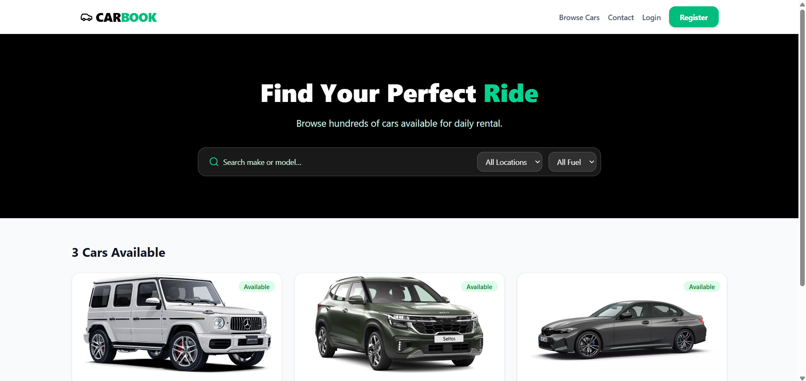

# 🏎️ Carbook: Concurrency-Safe Peer-to-Peer Rental System

**Carbook** is a backend-driven peer-to-peer rental platform designed to handle **concurrent booking conflicts, payment race conditions, and failure-safe transaction flows**.

Unlike typical CRUD applications, the system is built around **data integrity under real-world edge cases**—including duplicate payments, overlapping booking attempts, and partial system failures.

---

## 🚀 Live Preview



🌐 https://carbook-modern.vercel.app
🎥 Demo: https://drive.google.com/file/d/1vkLT_0JmQPbDshnC3oini55sEdCwb2uI/view

---

## 🧠 Core Engineering Focus

This project is centered around solving **non-trivial backend problems**:

* Concurrency control in booking systems
* Payment integrity under duplicate or delayed callbacks
* Idempotent API design
* Failure-safe data handling
* Server-side trust boundaries

---

## ⚡ Engineering Challenges & Solutions

### 🧵 Concurrent Booking Conflicts

**Problem:** Multiple users attempting to book the same vehicle simultaneously

**Solution:**

* Backend-enforced validation with transactional safeguards
* Payment timestamp verification to resolve conflicts deterministically
* Automatic refund flow triggered for failed booking attempts via Razorpay

---

### 💳 Payment Integrity & Idempotency

**Problem:** Duplicate or delayed payment callbacks causing inconsistent state

**Solution:**

* Idempotent payment processing layer
* Ensures a booking is confirmed exactly once per successful transaction
* Prevents duplicate bookings and inconsistent financial records

---

### 🧮 Secure Pricing Engine

**Problem:** Client-side manipulation of pricing and rental duration

**Solution:**

* Fully server-side pricing computation using validated datetime logic
* Backend acts as the single source of truth for all pricing decisions

---

### 🧱 Failure-Safe Data Design

**Problem:** Deleting entities (cars/users) breaking active bookings or financial history

**Solution:**

* Introduced **graceful suspension model** instead of destructive deletes
* Preserves historical and financial data integrity across all flows

---

### 🔐 Strict Access Control

**Problem:** Unauthorized access to user-specific resources

**Solution:**

* Enforced backend-level authorization (no client trust)
* Role + ownership validation for every critical operation

---

## 🏗️ Architecture Overview

* **Frontend:** React (Vite) + React Query
* **Backend:** Django + Django REST Framework
* **Database:** PostgreSQL (transactional consistency)

### External Services

* **Razorpay:** Payment processing + automated refunds
* **Cloudinary:** Media storage (vehicle images & documents)

> The backend is designed as the **single source of truth**, with all critical logic (booking validation, pricing, payments) enforced server-side.

**Deployment:** Backend on [Render](https://render.com) · Frontend on [Vercel](https://vercel.com) · Database on [Neon](https://neon.tech) (PostgreSQL)

---

## 📊 System Design Considerations

* Designed to handle **concurrent booking collisions** safely
* Ensures **idempotent operations** in payment workflows
* Uses **atomic database operations** for critical state transitions
* Implements a **state-driven booking lifecycle**
  *(Pending → Confirmed → Completed → Cancelled)*
* Validated behavior under simulated concurrent requests

---

## ⚖️ Key Design Trade-off

> Prioritized **data consistency over latency** in booking and payment flows

The system intentionally accepts slightly higher response times to guarantee:

* No double bookings
* No financial inconsistencies
* Strong transactional integrity

---

## 🛠️ Tech Stack

**Frontend**

* React, Vite, Tailwind CSS, React Query

**Backend**

* Django, Django REST Framework, PostgreSQL
* JWT Authentication (SimpleJWT)

---

## 📂 Project Structure

```
carbook-modern/
├── backend/
│   ├── core/
│   ├── backend_api/
│   └── staticfiles/
├── frontend/
│   ├── components/
│   ├── pages/
│   └── services/
└── README.md
```

---

## 🚀 Running Locally

### Backend

> Copy the example env file and fill in your credentials:

| Variable | Description |
|---|---|
| `SECRET_KEY` | Django secret key |
| `DATABASE_URL` | PostgreSQL connection string |
| `RAZOR_KEY_ID` | Razorpay public key |
| `RAZOR_KEY_SECRET` | Razorpay secret key |
| `CLOUDINARY_CLOUD_NAME` | Cloudinary media storage |
| `EMAIL_HOST_USER` | Gmail SMTP address |
| `FRONTEND_URL` | Your Vercel domain |

```bash
cd backend
python -m venv venv
source venv/bin/activate  # Windows: venv\Scripts\activate
pip install -r requirements.txt
cp .env.example .env      # Fill in your API keys
python manage.py migrate
python manage.py runserver
```

### Frontend

```bash
cd frontend
npm install
npm run dev
```

---

## 🎯 What Makes This System Non-Trivial

* Handles **real-world concurrency issues**, not just user flows
* Designed with **defensive backend principles** (zero client trust)
* Ensures **financial correctness under failure scenarios**
* Implements **idempotency and transactional safeguards**
* Built with a **consistency-first architecture mindset**

---

## 🧾 Summary

Carbook is not just a feature-driven application—it is a **backend-focused system designed to simulate production-grade challenges**, particularly around concurrency, payments, and data integrity.

It reflects an emphasis on **correctness, reliability, and system design over surface-level features**.
